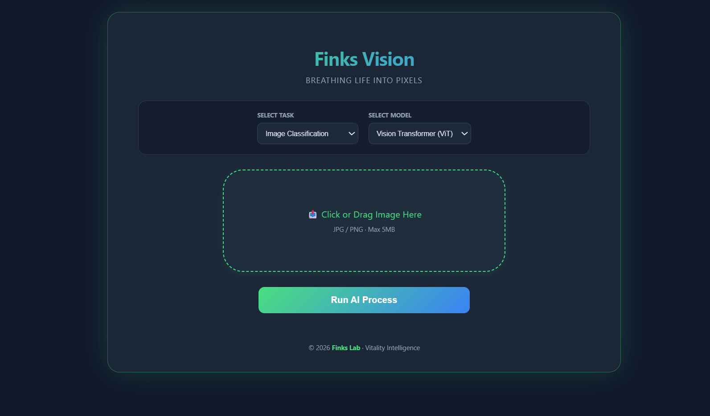

## 🧠 AI Vision Multi-Task Web Platform

一个基于 **PyTorch + FastAPI + Web 前端** 的多任务计算机视觉推理平台，支持 **图像分类、目标检测、语义分割**，并可在线选择不同深度学习模型进行推理与结果可视化，适用于 AI 技术展示与工程化实践。

---

### ✨ 功能特性

* ✅ 支持 **图像分类 / 目标检测 / 语义分割** 多任务推理
* ✅ 支持多模型动态切换

  * 分类：ResNet50、Vision Transformer (ViT)
  * 检测：Faster R-CNN
  * 分割：DeepLabV3-ResNet50
* ✅ Web 前端支持拖拽上传、图片预览、模型选择
* ✅ 推理结果在线可视化（分类概率 / 检测框 / 分割 Mask）
* ✅ 前后端解耦，模型接口统一，易于扩展新模型

---

### 🏗️ 系统架构

```text
Frontend (HTML / CSS / JS)
        ↓
FastAPI Inference API
        ↓
PyTorch Models
(Classification / Detection / Segmentation)
```

---

### 🔧 技术栈

* **后端**：Python, FastAPI, PyTorch
* **前端**：HTML5, CSS3, JavaScript
* **模型**：ResNet50, ViT, Faster R-CNN, DeepLabV3
* **推理模式**：CPU / GPU（可扩展）

---

### 🚀 运行方式

```bash
pip install -r requirements.txt
uvicorn app.main:app --reload
```

浏览器访问：

```
http://127.0.0.1:8000
```

---

### 📌 项目亮点

* 将不同视觉任务统一抽象为 **标准推理接口**
* 覆盖 CNN / Transformer / Encoder–Decoder 多种视觉建模范式
* 注重 AI 工程化落地，而非单模型实验

---

### 📷 Demo Screenshot

> 


